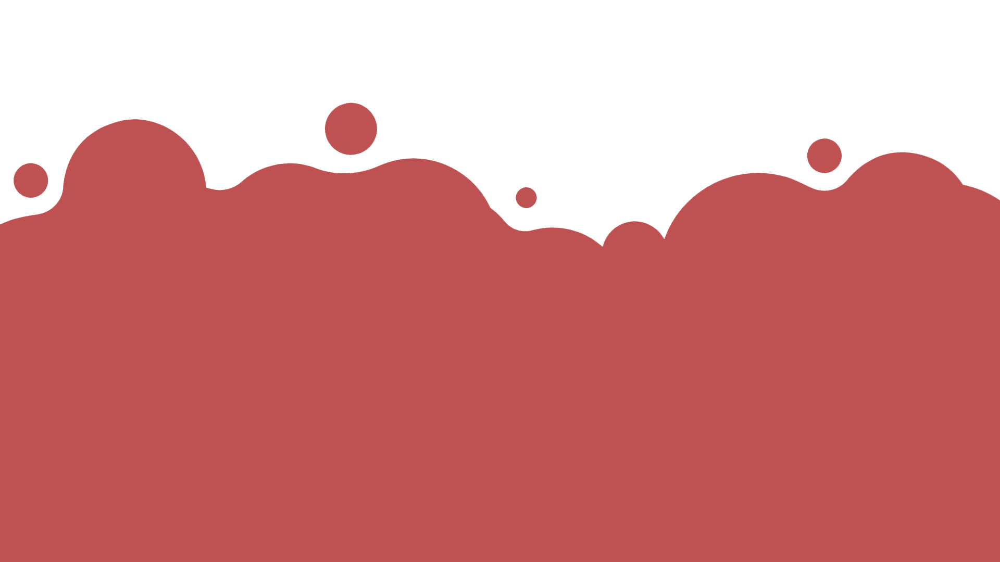

### Welcome to my profile!

I am a Cloud engeneer @ [Altheria](https://altheria.com/)

### Some fun facts about me! 

 

## Connect with me:

 

 

## Languages and Tools:

 

### Languages

 

 

  

 

 

 

 

 
 

### Frameworks 
 

 
 
 

 

 
 
 

 

 

 
 
 
 
 

### Software 
---

 

 
 

 

 

 

 

## **GitHub Stats**
 

You are visitor: 

